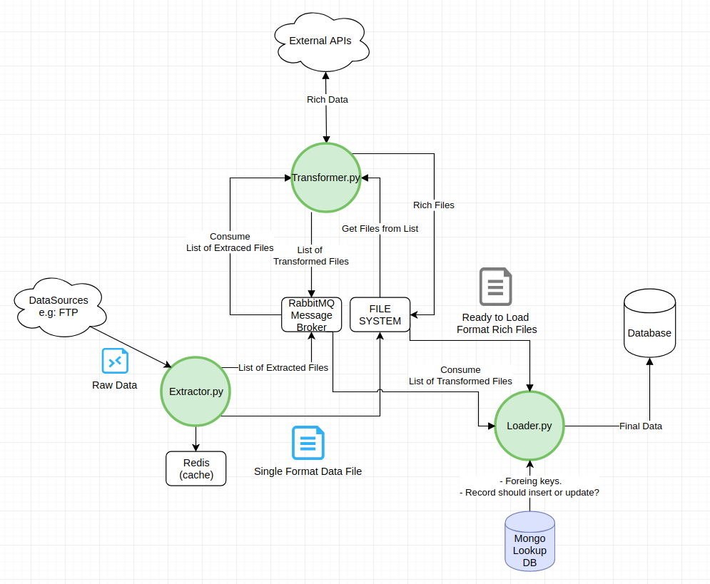

# ETL Python

## Solução proposta

A proposta apresentada consiste em uma conjunto de 3 micro serviços desenvolvidos em Python. Cada um responsável por uma etapa distinta do ETL (Extração, Transformação e Carregamento)

Os micro serviços e o restante da arquitetura proposta tem como principal objetivo possibilitar o *balanceamento* e a *escalabilidade* do sistema para atender em especial o requisito:

> Os dados enriquecidos são utilizados em nosso produto exponencial e de alta demanda, e pode ser necessário processar milhões de novas coordenadas por dia.

*Escalabilidade*: É possível instanciar *n* em paralelo sem que haja conflito ou inconsistência nos dados processados. Isso se deve graças a arquitetura, utilizando sistemas como filas de mensagens(RabbitMQ) e cache(Redis) para evitar reprocessamentos e perda de dados.

*Balanceamento*: Por se tratar de serviços interdependentes, é possível *subir* diferente quantidades e *threads* para cada serviço conforme a demanda. 
Por exemplo, se o processo de Extração estiver demandando mais processamento, é possível instanciar mais serviços *Extractor*. Por outro lado, se o processo de Load estiver demandando mais processamento, é possível instanciar mais serviços *Loader*, etc.

## Arquitetura

A arquitetura conta com:
* 3 micro serviços em Python (Extractor, Transformer e Loader)
* Redis: Sistema de Cache em RAM, utilizado no Extractor para evitar download e extrações de arquivos repetidamente
* RabbitMQ: Sistema de Gerenciamento de Filas de Mensagens, utilizado por todos os micro serviços. Faz a ponte de comunicação entre os serviços, "avisando" a etapa seguinte que deve processar dados da etapa anterior em tempo real.
* Google GeocodingAPI: Fornece os dados para enriquecimento dos dados (endereços completos)
* MongoDB: Utilizado como banco de dados *Lookup*. Possibilita que o serviço *Loader* efetue *bulk inserts* e *bulk updates*, melhorando a performance na inserção de dados no DW.
* FTP: Utilizado para simular um *Datasource*
* Mysql: Utilizado como Data Warehouse

### Fluxo de dados

#### Extractor
* Efetua varreduras no servidor FTP, através de *loops* com tempo de intervalo definidos em configuração.
    * Ao encontrar arquivos para download:
        * Instancia uma nova thread(subprocesso) para efetuar o donwload e extração de cada arquivo, um arquivo por thread.
        * Extrai **Latitude** e **Longitude** dos arquivos.
        * Salva os dados extraidos em disco no formato comma-separated values (csv).
        * Posta os arquivos processados no Rabbit para ser posteriormente processado pelo *Transformer*.
        * Adiciona os arquivos ao cache Redis para evitar download e processamentos desnecessários. 

#### Transformer
* Instancia *n* threads(subprocesso), definidos em configuração, cada uma das threads abre um *Listener*, escutando as filas do RabbitMQ a procura de arquivos processados pelo *Extractor*.
    * Thread, ao encontrar os arquivos no Rabbit:
        * Carrega o arquivo do disco.
        * Faz chamadas a GeocodingAPI do GoogleMaps para obter endereços completos, passando como parametro latitudes e longitudes obtidas dos arquivos processados pelo *Extractor*.
        * Salva os dados enriquecidos em disco no formato csv.
        * Posta os arquivos processados no Rabbit para ser posteriormente processado pelo *Loader*.
    * Permanece "escutando" as filas do Rabbit em busca de mensagens de arquivos a processar.

#### Loader
* Instancia *n* threads(subprocesso), definidos em configuração, cada uma das threads abre um *Listener*, escutando as filas do RabbitMQ a procura de arquivos processados pelo *Transformer*.
    * Thread, ao encontrar os arquivos no Rabbit:
        * Carrega o arquivo do disco.
        * Verifica se o registro já existe no banco de dados *Lookup* (MongoDB)
            * Caso exista, adiciona o registro a lista de UPDATE
            * Senão, adiciona o registro na lista de INSERT, e atualiza o Lookup.
        * Executa a lista de INSERT e UPDATE no Data Warehouse (Mysql).
    * Permanece "escutando" as filas do Rabbit em busca de mensagens de arquivos a processar.

## Runbook

### Script do Banco de Dados

O script de criação do banco de dados se encontra em **/docs/**
Mais informações sobre o como acessar o Mysql CLI na sessão **Visualizando  os Dados*

### Subindo a aplicação

Seguir as seguintes etapas para subir o sistema de ETL:

**Na raiz do diretório /avaliacao**:

* 1º - Subir a stack segundária (bancos de dados, caches, etc)

    `$ docker-compose up rabbitmq mysql ftp_files_ds mongo mongo-express redis`

* 2º - Subir a stack dos micro serviços

    `$ docker-compose up extractor transformer loader`

No terminal utilizado para subir a stack dos micro serviços é possivel acompanhar os logs de execução de cada microserviço.

* ***Opcional*** - Escalonar os micro serviços

    `$ docker-compose scale extractor=4 transformer=5 loader=3`

### Adicionando arquivos para processamento

É utilizado um container de FTP para simular um Datasource.

Para adicionar arquivos para processamento, basta acessar o servidor FTP, utilizando a ferramenta de sua escolha (ex.: FileZilla) e fazer upload dos arquivos data_points.txt para o diretório raiz do usuário.

> Dados de acesso também disponíveis no docker-compose.yml

``Servidor FTP: localhost (0.0.0.0)``

``Usuario: username``

``Senha: mypass``

### Visualizando os dados

É utilizado um container de Mysql para simular o Data Warehouse.
É necessário entrar no container via *bash*, e executar SELECTS no Mysql Client:

Mais informações em: https://docs.docker.com/engine/reference/commandline/exec/

> Dados de acesso também disponíveis no docker-compose.yml

* Lista os ids dos containers:

    `$ docker ps`

* Acessa o container via *bash*

    `$ docker exec -it <hash_id_do_container_mysql> bash`

* Dentro do container, executar o Mysql CLI:

    `$ mysql -u root -p`
    
    ``Senha root: example``

    ``Schema (nome do banco de dados): etl4all``

    ``Tabela: address``

* Query de exemplo:
    
    `SELECT * FROM address`

